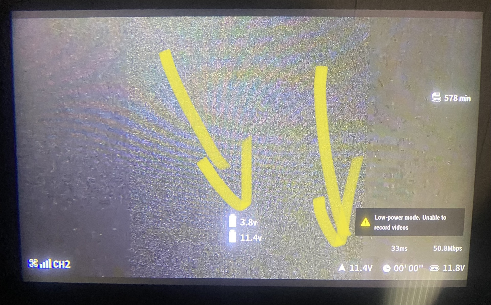

## DJI HD FPV mini OSD

I was lacking voltage OSD information on a small RC plane which had no flightcontroller.
So I've forked [this project](https://github.com/d3ngit/djihdfpv_mavlink_to_msp_V2) to build a mini OSD based on a voltage devider and a small arduino.

### Requirements:
- Arduino Pro Micro
- 2 resistors (22K, 4K7)

### Features:
- adds cell and total voltage to OSD
- allows to unlock/arming a Caddx Vista or Airunit via high PWM input once

### Setup:
- connect VIN and GND to a 5V source
- connect TXD to Vista RX Pad
- connect PIN10 to any Servo Pin, like Rudder
- connect Voltage Divider on A1 to VBAT
	- A1 - [R1 22K] - GND
	- A1 - [R2 4K7] - VBAT

	
### Usage:
- make sure the arduino is powered up with the vbat (if not, the cell detection might get it wrong and display wacky numbers)
- enable custom OSD on DJI
- Voltage should appear
- give high PWM input to unlock the device to full power

